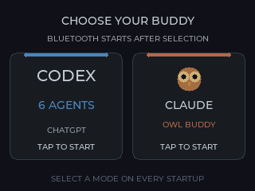
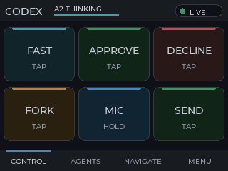
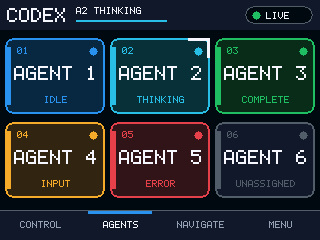
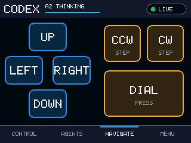
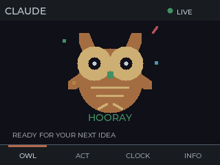
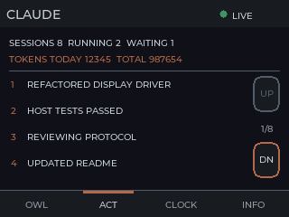
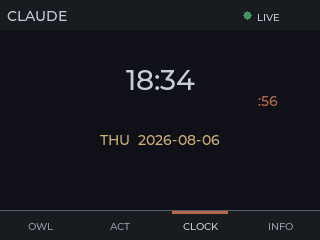
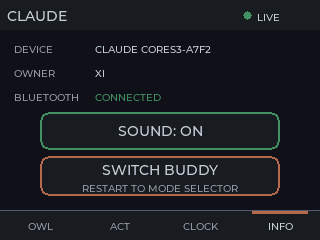

# Codex Buddy

[](https://github.com/xichen-de/codex-buddy-cpp/actions/workflows/ci.yml)

Codex Buddy turns an [M5Stack CoreS3](https://docs.m5stack.com/en/core/CoreS3)
into a touchscreen desktop companion. Choose a mode at startup:

- **Codex:** six Agent keys, common actions, navigation controls, and live
  status for ChatGPT Desktop.
- **Claude:** an animated owl, activity and token summaries, a clock, and
  permission controls for Claude's Hardware Buddy interface.

Both modes are hardware-validated on CoreS3.

> [!IMPORTANT]
> This is an unofficial experimental hobby project. It is not affiliated with
> or supported by OpenAI or Anthropic. Both desktop integrations may change or
> stop working without notice.

## Project status

| Mode | Software status | Hardware status |
| --- | --- | --- |
| Codex | Implemented and covered by host tests | Validated on CoreS3 with macOS 26.5.2 and ChatGPT Desktop 26.730.61639 |
| Claude | Implemented and covered by host tests | Validated on CoreS3 with macOS 26.5.2 and Claude 1.34493.1 |

Compatibility is version-specific: Codex Micro is undocumented, and Claude's
Hardware Buddy interface is experimental. See the
[hardware validation record](docs/HARDWARE_TEST.md) for the exact checks and
known gaps.

## Interface

The device asks which buddy to start before enabling Bluetooth:

<p align="center">
  
</p>

### Codex

| Control | Agents | Navigate |
| :---: | :---: | :---: |
|  |  |  |

### Claude

| Owl | Activity | Clock | Info |
| :---: | :---: | :---: | :---: |
|  |  |  |  |

These previews come from the same 320 x 240 RGB565 renderers used by the
physical display, including LVGL's anti-aliased Montserrat fonts. Regenerate
them with `sh scripts/render_ui_previews.sh` after UI changes.

## Using Codex mode

You need a Mac with Bluetooth, ChatGPT Desktop with Codex Micro support, and a
CoreS3 running this firmware.

1. Choose **Codex** on the CoreS3.
2. In macOS **System Settings → Bluetooth**, connect to **Codex Micro**.
3. Open **ChatGPT → Settings → Codex Micro** and grant Input Monitoring if
   prompted.
4. Under **Options → Agent keys**, choose how the six Agent slots are assigned.
5. Wait for ChatGPT to report an active Codex Micro connection.

The touchscreen pages provide:

- **Control:** Fast, Approve, Decline, Fork, Mic, and Send.
- **Agents:** select one of six configured Agent slots and view its status.
- **Navigate:** directions, counter-clockwise, dial press, and clockwise.

Mic records from the Mac only while the button is held. To change modes, open
**Menu → Switch Buddy**; the device restarts without erasing pairing data.
Codex plays distinct cues when an Agent needs input, completes, or errors. Use
**Menu → Sound** to mute or unmute all notification sounds.

### Codex troubleshooting

- If Bluetooth connects but ChatGPT does not, fully quit and reopen ChatGPT,
  then confirm Input Monitoring is enabled.
- If controls do nothing, confirm ChatGPT shows Codex Micro as active and that
  its Agent keys are assigned.
- After a firmware update that changes the HID descriptor, forget **Codex
  Micro** in Bluetooth settings and pair it again.

Codex Micro is an undocumented compatibility interface and requires your own
authorized ChatGPT account.

## Using Claude mode

You need Claude for macOS or Windows with Hardware Buddy Developer Mode, plus a
CoreS3 running this firmware.

1. Choose **Claude** on the CoreS3.
2. In Claude, enable **Help → Troubleshooting → Enable Developer Mode**.
3. Open **Developer → Open Hardware Buddy…** and choose the device beginning
   with `Claude CoreS3`.
4. Enter the six-digit passkey shown on the CoreS3.
5. Wait for the owl header to show **LIVE**.

Claude mode includes:

- An animated owl that reacts to activity and permission requests.
- Eight recent activity entries, session counts, and token totals.
- A timezone-aware clock synchronized by Claude.
- One-time Approve and Deny controls for permission prompts.
- Attention, completion, and error sound cues, plus shake reactions and
  face-down screen sleep. Claude error cues require an error-bearing turn event.

Place the device screen-up and flat once after startup to calibrate its
orientation. Touch or a permission request wakes the display. Use **Info →
Sound** to change the shared persisted mute setting, or **Info → Switch Buddy**
to return to the startup selector.

Pairing is stored on the device and normally survives restarts. Pair again if
you forget the device on the computer, erase NVS, or change its BLE identity.
Claude mode uses an experimental developer API; see
[HARDWARE_TEST.md](docs/HARDWARE_TEST.md) for the completed validation record.

## Power safety

> [!WARNING]
> The firmware does not manage the CoreS3 battery charger or USB power path.
> Disconnect the device immediately if it becomes unusually warm, smells
> unusual, or makes noise.

Normal operation uses Bluetooth and does not require a USB cable.

After inactivity, both modes dim the backlight after 15 seconds and turn the
LCD panel off after one minute while keeping Bluetooth connected. Touch wakes
the display; the first touch from off is consumed to avoid activating a hidden
control. Permission prompts, pairing passkeys, waiting Claude sessions, and
Codex Agents requiring input immediately restore and hold normal brightness
until the action is resolved.

## Development

The firmware uses C++20, ESP-IDF, and PlatformIO. Project code is organized as
ESP-IDF components under `components/`, with application composition and event
loops under `main/`.

### Build and test

The first build downloads the pinned CoreS3 BSP and BMI270 component.

```sh
pio run -e m5stack-cores3
pio run -e m5stack-cores3-debug
bash test/host/run.sh
```

These commands build and run hardware-independent tests without modifying a
connected device.

### Flash and monitor

Connect one known CoreS3 and verify its serial port before uploading:

```sh
pio run -e m5stack-cores3 -t upload
pio device monitor -b 115200
```

Flashing changes the connected device. Do not edit generated files under
`.pio/` or `build/`.

### Documentation

- [Architecture](docs/ARCHITECTURE.md): components, ownership, and data flow
- [Protocol notes](docs/PROTOCOL.md): Codex HID framing, RPCs, and compatibility
- [Hardware validation](docs/HARDWARE_TEST.md): tested configurations and
  completed checks for both modes
- [Contributor guide](AGENTS.md): project conventions and verification rules

## Credits

Codex mode builds on the protocol research published in
[imliubo/codex-micro-4-core2](https://github.com/imliubo/codex-micro-4-core2).
Claude mode implements Anthropic's documented
[Hardware Buddy protocol](https://github.com/anthropics/claude-desktop-buddy/blob/main/REFERENCE.md).
See [THIRD_PARTY_NOTICES.md](THIRD_PARTY_NOTICES.md) for attribution and license
details.

## License

Codex Buddy is available under the [MIT License](LICENSE), copyright 2026 Xi
Chen.
